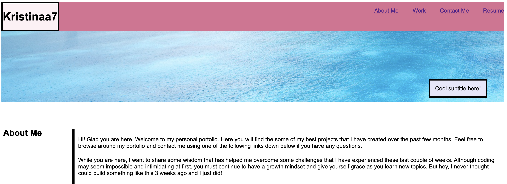
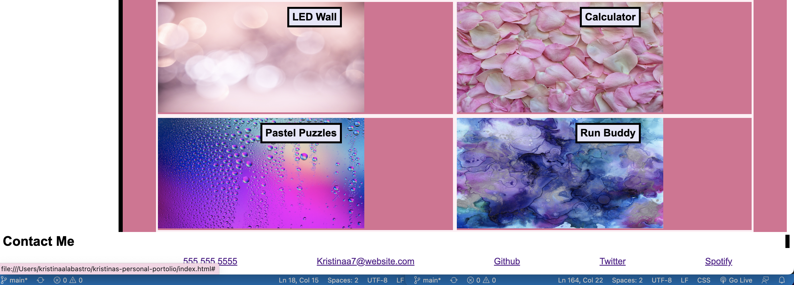

# Kristina Alabastro Personal Portolio Webpage

## Description

Welcome to my personal portolio website. Here you will find a little bit about me and the projects that I have worked on either individually or in a good setting. At the bottom of the page you can find my contact information as well as social links to external pages. This portolio acts as a way for future employers to learn a little bit about me and see samples of my work to further promote my coding abilities learnt in class.

## Installation

N/A

## Usage

To check out specific sections on my personal portolio, you can use the navigation bar at the top right-hand side of the webpage to be  brought directly over to each section. Review my projects in the Work section to see my process and growth during the UW Full Stack Bootcamp.

### Screenshots to Website

## Unique Link
https://kristinaa7.github.io/kristina-alabastros-original-personal-portolio/

## Credits

N/A

